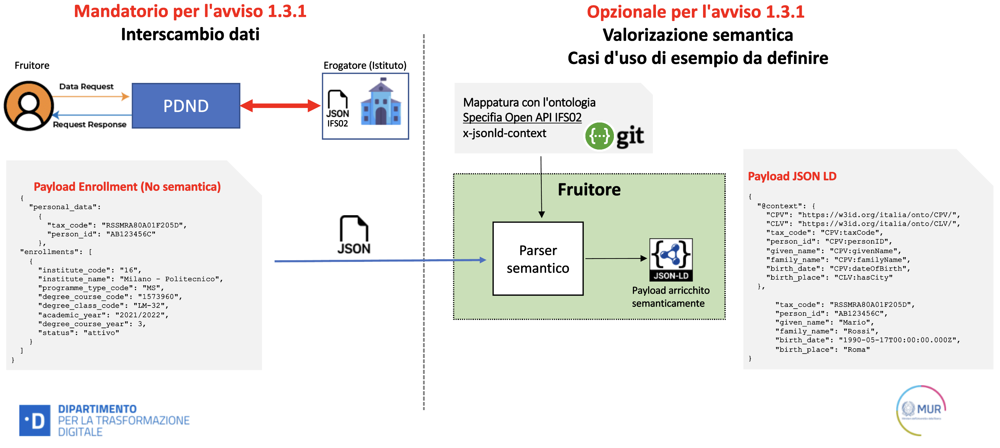

<div align="center">
    
     
</div>  

<div align="center">
    <a href="https://github.com/italia/api-padigitale2026-misura1.3.1-uni-afam/graphs/contributors"></a>
    <a href="https://github.com/italia/api-padigitale2026-misura1.3.1-uni-afam/issues"></a>
    <a href="https://github.com/italia/api-padigitale2026-misura1.3.1-uni-afam/issues?q=is%3Aissue+is%3Aclosed"></a>
    <a href="https://github.com/italia/api-padigitale2026-misura1.3.1-uni-afam/pulse/monthly" alt="Activity"></a>        
  </div>


# API di PAdigitale2026 - Misura 1.3.1 - Avvisi per Università e AFAM pubblici

Questo repository contiene le specifiche delle API relative alla misura 1.3.1 per l'avviso dedicato alle Università pubbliche e AFAM (Alta Formazione Artistica, Musicale e Coreutica) pubblici, nell'ambito di PAdigitale2026. 

La tabella sottostante (Tabella 1) riporta il dettaglio del titolo e descrizione per tutte e nove le API (dalla IFS01 alla IFS09) che dovranno essere erogate dai Soggetti Attuatori in base alla fascia di appartenenza. 
git status
<table>
       <caption>Tabella 1 – Descrizione delle nove API assegnate alle cinque fasce di Università e AFAM</caption>

  <th>Use Case</th>
  <th>API-ID</th>
  <th>e-service-name</th>
  <th>API-Method</th>
  <th>e-service description</th>
  
  <tr>
      <td rowspan="2">Offerta formativa</td>
      <td rowspan="2">IFS01</td>
      <td rowspan="2">ifs-&lt;codice istituto&gt;-offerta-formativa</td>
      <td>IFS01.1</td>
      <td>Acquisizione della lista dei corsi di studio offerti da un Istituto di
          formazione superiore in un dato anno accademico</td>
  </tr>
  <tr>
      <td>IFS01.2</td>
      <td>Acquisizione del dettaglio di un corso di studio offerto da un Istituto di
          formazione superiore</td>
  </tr>
  <tr>
      <td rowspan="5">Iscrizioni</td>
      <td rowspan="5">IFS02</td>
      <td rowspan="5">ifs-&lt;codice istituto&gt;-iscrizioni</td>
      <td>IFS02.1</td>
      <td>Acquisizione del dettaglio delle iscrizioni attive negli ultimi tre anni
          accademici di una studentessa o di uno studente</td>
  </tr>
  <tr>
      <td>IFS02.2</td>
      <td>Acquisizione delle prove riguardanti l'iscrizione agli studi di istruzione
          terziaria di una studentessa/studente</td>
  </tr>
  <tr>
      <td>IFS02.3</td>
      <td>Acquisizione delle prove riguardanti la trascrizione (corsi seguiti, voti
          ottenuti, ecc.) degli studi di istruzione terziaria di una studentessa/studente. La trascrizione può
          riferirsi a studi completati o in corso</td>
  </tr>
  <tr>
      <td>IFS02.4</td>
      <td>Acquisizione delle prove riguardanti l'ammissione agli studi di istruzione
          terziaria di una studentessa/studente;</td>

  </tr>
  <tr>
      <td>IFS02.5</td>
      <td>Acquisizione delle prove relative alle attività di apprendimento svolte al di
          fuori dell'istituzione di istruzione terziaria dalla quale una studentessa/studente ha ottenuto il
          proprio diploma</td>
  </tr>
  <tr>
      <td rowspan="4">Titoli</td>
      <td rowspan="4">IFS03</td>
      <td rowspan="4">ifs-&lt;codice istituto&gt;-titoli</td>
      <td>IFS03.1</td>
      <td>Acquisizione del dettaglio dei titoli accademici conseguiti da una
          studentessa/uno studente</td>
  </tr>
  <tr>
      <td>IFS03.2</td>
      <td>Acquisizione delle prove riguardanti il completamento degli studi di
          istruzione terziaria </td>
  </tr>
  <tr>
      <td>IFS03.3</td>
      <td>Acquisizione delle prove riguardanti il livello di qualifica degli studi di
          istruzione terziaria</td>
  </tr>
  <tr>
      <td>IFS03.4</td>
      <td>Acquisizione delle prove relative allo strumento "Diploma Supplement"</td>
  </tr>
  <tr>
      <td rowspan="4">Rettifica iscrizioni</td>
      <td rowspan="4">IFS04</td>
      <td rowspan="4">ifs-&lt;codice istituto&gt;-rettifica-iscrizioni</td>
      <td>IFS04.1</td>
      <td>Richiesta di rettifica di un'iscrizione accademica di una studentessa/uno
          studente all'Istituto di formazione superiore</td>
  </tr>
  <tr>
      <td>IFS04.2</td>
      <td>Acquisizione dello stato delle richieste di rettifica delle iscrizioni
          accademiche di una studentessa/uno studente all'Istituto di istruzione superiore</td>
  </tr>
  <tr>
      <td>IFS04.3</td>
      <td>Richiesta di annullamento di una richiesta di rettifica di una iscrizione
          accademica di una studentessa/uno studente all'Istituto di istruzione superiore</td>
  </tr>
  <tr>
      <td>IFS04.4</td>
      <td>Invio di una segnalazione dall'ente fruitore all'ente erogatore per comunicare
          eventuali anomalie sui dati delle iscrizioni accademiche</td>
  </tr>
  <tr>
      <td rowspan="4">Rettifica titoli</td>
      <td rowspan="4">IFS05</td>
      <td rowspan="4">ifs-&lt;codice istituto&gt;-rettifica-titoli</td>
      <td>IFS05.1</td>
      <td>Richiesta di rettifica di un titolo accademico di una studentessa/uno studente
          all'Istituto di formazione superiore</td>
  </tr>
  <tr>
      <td>IFS05.2</td>
      <td>Acquisizione dello stato delle richieste di rettifica dei titoli accademici di
          una studentessa/uno studente all'Istituto di istruzione superiore</td>
  </tr>
  <tr>
      <td>IFS05.3</td>
      <td>Richiesta di annullamento di una richiesta di rettifica di un titolo
          accademico di una studentessa/uno studente all'Istituto di istruzione superiore</td>
  </tr>
  <tr>
      <td>IFS05.4</td>
      <td>Invio di una segnalazione dall'ente fruitore all'ente erogatore per comunicare
          eventuali anomalie sui dati dei titoli accademici</td>
  </tr>
  <tr>
      <td>Variazioni Iscrizioni</td>
      <td>IFS06</td>
      <td>ifs-&lt;codice istituto&gt;-variazioni-iscrizioni</td>
      <td>IFS06.1</td>
      <td>Acquisizione delle "impronte (codifica hash)" di tutte le iscrizioni delle
          studentesse/degli studenti negli ultimi tre anni accademici al fine di identificarne le variazioni
          dal punto di vista del fruitore</td>
  </tr>
  <tr>
      <td>Variazioni titoli</td>
      <td>IFS07</td>
      <td>ifs-&lt;codice istituto&gt;-variazioni-titoli</td>
      <td>IFS07.1</td>
      <td>Acquisizione delle "impronte (codifica hash)" di tutti i titoli accademici al
          fine di identificarne le variazioni dal punto di vista del fruitore</td>
  </tr>
  <tr>
      <td>Iscritti per fasce ISEE</td>
      <td>IFS08</td>
      <td>ifs-&lt;codice istituto&gt;-iscrizioni-per-fasce-isee</td>
      <td>IFS08.1</td>
      <td>Acquisizione del numero di studentesse e studenti per fasce ISEE in un anno
          accademico</td>
  </tr>
  <tr>       
      <td>Iscritti a un corso per anno</td>
      <td>IFS09</td>
      <td>ifs-&lt;codice istituto&gt;-iscrizioni-per-corso</td>
      <td>IFS09.1</td>
      <td>Acquisizione del numero di studentesse e studenti iscritti a un corso di studi
          per anno accademico</td>
  </tr>    
</table>

Come indicato nella tabella sottostante (Tabella 2), gli Atenei e AFAM pubblici che possono aderire all’avviso sono divisi in fasce basate sul numero di iscritti, a cui corrisponde un numero preciso di API da erogare, dettagliate nella tabella 1. 

 
| Fascia | Iscritti | API (API ID) |
|--------|----------|--------------|
|1       |  <=1.000 | 7 (IFS01 – IFS07) |
|2       | 1.000 < iscritti <= 10.000 |8 (IFS01 – IFS08) |
|3       | 10.000 < iscritti <= 20.000 |8 (IFS01 – IFS08) |
|4       | 20.000 < iscritti <= 40.000 |9 (IFS01 – IFS09) |
|5       |> 40.000 | 9 (IFS01 – IFS09) |

Tabella 2 – Fasce di Università in base al numero di studentesse e studenti iscritti ed API da erogare per ogni fascia. 

## Da sapere prima di iniziare a leggere le Linee Guida

**1** - Il Ministero dell'Università e della Ricerca (MUR) pubblica i seguenti vettori di dati codificati come open data a supporto dell'interoperabilità e dell'anagrafe ANIS
>1. Tipi di corsi
>1. Corsi di studio
>1. Classi di laurea
>1. Istituti di formazione superiore

:warning: **I canali di pubblicazione di questi vettori di dati da parte del MUR sono ancora in fase di definizione**

 Lo schema dei dataset può essere approfondito nella sezione [risorse utili](#risorse-utili)

**2** -  **Nomi di pubblicazione degli e-service su PDND**</br>
:warning: Si ricorda che in fase di pubblicazione degli e-service sulla piattaforma PDND, il nome deve rispettare quello nella colonna denominata e-service della tabella 1, ossia il seguente pattern:
``` 
    ifs-<codice istituto>-<nome e-service>
    ifs-16-offerta-formativa
```

**3** - La visualizzazione della specifica Open API e dei relativi esempi può essere ottenuta utlizzando [l'editor swagger](https://editor-next.swagger.io/) e copiando il contenuto dei file di tipo yaml che verranno forniti via via nella seguente trattazione di dettaglio.

**4** - Perché abbiamo scelto di usare principalmente il metodo POST - [GET Method vs POST Method](https://github.com/italia/api-padigitale2026-misura1.3.1-uni-afam/issues/91)
>1. [URIs, Addressability, and the use of HTTP GET and POST](https://www.w3.org/2001/tag/doc/whenToUseGet.html#:~:text=HTTP%20GET%20promotes%20URI%20addressability,(or%20of%20related%20resources).)
>1. [w3shools-ref  Compare GET vs. POST chapter](https://www.w3schools.com/tags/ref_httpmethods.asp)

**5** - Suggeriamo infine di fare riferimento sempre alla sezione 
[risorse utili](#risorse-utili) che è aggiornata periodicamente.

## Linee Guida e-service

<p align="center">
 
</p>

In questo paragrafo sono descritte le seguenti API:

1. [IFS01 Offerta Formativa](#ifs01-offerta-formativa)
2. [IFS02 Iscrizioni](#ifs02-iscrizioni)
3. [IFS03 Titoli](#ifs03-titoli)
4. [IFS04 Rettifica iscrizioni](#ifs04-rettifica-iscrizioni)
5. [IFS05 Rettifica titoli](#ifs05-rettifica-titoli)
6. [IFS06 Variazioni Iscrizioni](#ifs06-variazioni-iscrizioni)
7. [IFS07 variazione titoli](#ifs07-variazione-titoli)
8. [IFS08 Iscrizioni per fasce ISEE](#ifs08-iscrizioni-per-fasce-isee)
9. [IFS09 Iscrizioni per corso](#ifs09-iscrizioni-per-corso)


### IFS01 Offerta formativa

 Definizione [OpenApi.yaml](src/IFS01-offerta-formativa.yaml)  

#### :globe_with_meridians: IFS01.1 - educational-offering-list

Acquisizione della lista dei corsi di studio offerti da un istituto di formazione superiore in un dato anno accademico

&emsp;&emsp;  Esempio IFS01.1 [Request](doc/03_analysis/io_schema/IFS01.1-request.json)


&emsp;&emsp;  Esempio IFS01.1 [Response](doc/03_analysis/io_schema/IFS01.1-response.json)

>   **Importante**
>
> * La richiesta prevede l'obbligatorietà della compilazione del campo **_academic_year_**. 
> * L'attributo  **_cursor_** è utile per la paginazione della risposta: </br>
&emsp;1. Alla prima invocazione non si valorizza l'attributo cursor </br>
&emsp;2. Se la response restituisce l'attributo cursor valorizzato, sarà necessario iterare le invocazioni per ottenere l'intero dataset </br>
&emsp;3. Per le invocazioni successive alla prima si valorizza il campo cursor con il valore ottenuto nell'ultima response
> * E' lasciata allo sviluppatore dell'API la gestione della paginazione e quindi della valorizzazione del cursor sulla response

#### :globe_with_meridians: IFS01.2 - educational-offering-detail

Acquisizione del dettaglio di un corso di studio offerto da un Istituto di formazione superiore

&emsp;&emsp; Esempio IFS01.2 [Request](doc/03_analysis/io_schema/IFS01.2-request.json)

&emsp;&emsp; Esempio IFS01.2 [Response](doc/03_analysis/io_schema/IFS01.2-response.json)

>   **Importante** 
>
> * Nella richiesta l'attributo **_degree_course_code_** è obbligatorio mentre l'attributo **_degree_class_code_** è obbligatorio solo quando il corso di studi ammette la classe

> :warning: **AFAM vs Università**
> * Nella response per gli **AFAM** compilare i campi learning_ssa e learinig_cfa
> * Nella response per le **università** compilare i campi learning_ssd e learinig_cfu
> * Vedere gli esempi presenti nello yaml/swagger e nella cartella doc/03_analysis/io_schema

:arrow_double_up:	 [Back to top ](#linee-guida-e-service)


### IFS02 Iscrizioni

Acquisisce il dettaglio delle iscrizioni accademiche.
Fornisce le informazioni di dettaglio riguardanti le iscrizioni di una studentessa o uno studente all'università o AFAM

&emsp;&emsp; Definizione [OpenApi.yaml](src/IFS02-iscrizioni.yaml)

#### :globe_with_meridians: IFS02.1 - academic-enrollments 

Acquisizione del dettaglio delle ultime iscrizioni attive degli ultimi tre anni accademici per ogni corso di una studentessa o di uno studente

&emsp;&emsp; Esempio IFS02.1 [Request](doc/03_analysis/io_schema/IFS02.1-request.json)


&emsp;&emsp; Esempio IFS02.1 [Response](doc/03_analysis/io_schema/IFS02.1-response.json)

>   **Importante**  
>
> Regole di obbligatorietà input
> * Nella request popolare almeno uno dei seguenti campi: tax_code o person_id. oppure il parametro key
> * Parametro key facoltativo
>
> Regole di obbligatorietà output (si prega di verificare gli esempi sul file openapi):
> 1. Nella struttura "Personal Data" è necessario prevedere la restituizione delle informazioni relative al codice fiscale e/o codice fiscale + personID
>```
>ESEMPIO 1: 
>
>"personal_data": {
>    "tax_code": "RSSMRA80A01F205D"
>  }
>
>ESEMPIO 2: 
>
>"personal_data": {
>    "tax_code": "RSSMRA80A01F205D",
>    "person_id": "AB123456C"
>  }
>```
> 2. Nella struttura "Personal Data" se il codice fiscale e/o il personID non sono presenti, restituire le informazioni given_name/family_name/birth_date/birth_place
>
>ESEMPIO 3: 
>
>```
>"personal_data": {
>    "given_name": Mario,
>    "family_name": Rossi,
>    "birth_date": 10-01-2022,
>    "birth_place": Roma, RM, Italia
>  }
>```
>
> 3. Nel caso in cui uno dei valori presenti al punto 2 non sia possibile valorizzarlo, è necessario NON restituire l'istanza dell'iscrizione e rimandare all'erorre 404 (vedi esempio nel file YAML)
>
>```
>ESEMPIO 4: 
>
>status code=404
>
>{
> "personal_data": null,
>  "enrollments": []
>}
>```
>
> 4. Nella struttura "enrollments" tutti i campi sono obbligatori tranne il degree_class_code. Nel caso in cui il degree_class_code non sia valorizzabile, è possibile passarlo con il valore NULL
> 5. nella struttura "enrollments", qualora sia presente un attributo non valorizzabile (ad escluisone del attirubuto degree_class_code) l'istanza dell'iscrizione non deve essere restituita. In questa casistica, qualora sia presente solamente una iscrizione, prevedere la restituzione dello status code 404 
>
>```Di seguito l'obbligatorietà con "*"
>
>   enrollment
>      institute_code * 
>      institute_name * 
>      programme_type_code * 
>      degree_course_code * 
>      degree_class_code 
>      academic_year * 
>      degree_course_year * 
>      status *
>```


#### :globe_with_meridians: IFS02.2 - proof-tertiary-education-enrollments

Acquisizione delle prove riguardanti l'ultima iscrizione a ogni corso di studi di istruzione terziaria di una studentessa/studente negli ultimi 3 anni accademici

&emsp;&emsp; Esempio IFS02.2 [Request](doc/03_analysis/io_schema/IFS02.2-request.json)

&emsp;&emsp; Esempio IFS02.2 [Response](doc/03_analysis/io_schema/IFS02.2-response.json)

>   **Importante**  
>  
> * Si prega di vedere le regole di [obbligatorietà output](#ifs02-Iscrizioni) presenti su [IFS02.1]

#### :globe_with_meridians: IFS02.3 - proof-tertiary-education-courses

Acquisizione delle prove riguardanti la trascrizione (corsi seguiti, voti ottenuti, ecc.) degli studi di istruzione terziaria di una studentessa/studente. La trascrizione può riferirsi a studi completati o in corso negli ultimi 3 anni accademici

&emsp;&emsp; Esempio IFS02.3 [Request](doc/03_analysis/io_schema/IFS02.3-request.json)

&emsp;&emsp; Esempio IFS02.3 [Response](doc/03_analysis/io_schema/IFS02.3-response.json)

>   **Importante**
>    
> * Si prega di vedere le regole di obbligatorietà output presenti su [IFS02.1]


#### :globe_with_meridians: IFS02.4 - proof-tertiary-education-admission

Acquisizione delle prove riguardanti le ultime ammissioni ai corsi di studi di istruzione terziaria di una studentessa/studente negli ultimi 3 anni accademici


&emsp;&emsp; Esempio IFS02.4 [Request](doc/03_analysis/io_schema/IFS02.4-request.json)

&emsp;&emsp; Esempio IFS02.4 [Response](doc/03_analysis/io_schema/IFS02.4-response.json)

>   **Importante**  
>  
> * Si prega di vedere le regole di obbligatorietà output presenti su [IFS02.1]


#### :globe_with_meridians: IFS02.5 - proof-mobility-periods

Acquisizione delle prove relative alle attività di apprendimento svolte al di fuori dell'istituzione di istruzione terziaria dalla quale una studentessa/studente ha ottenuto il proprio titolo accademico

&emsp;&emsp; Esempio IFS02.5 [Request](doc/03_analysis/io_schema/IFS02.5-request.json)

&emsp;&emsp; Esempio IFS02.5 [Response](doc/03_analysis/io_schema/IFS02.5-response.json)

>   **Importante**   
> 
> * Si prega di vedere le regole di obbligatorietà output presenti su [IFS02.1]

> :pencil2: **Note compilazione campi**  
>
> **birth_place**: 
> * Dove possibile il campo deve contenere le informazioni concatenate del Comune/Provincia/Nazione. 
> * il formato previsto prevede la seguente forma: *<nome_comune>, <codice_provincia>, <nome_nazione>*
>
> *Esempio: birth_place="Milano, MI, Italia"*
> * Nel caso di comuni esteri, se non fosse possibile recuperare il codice_provincia, si potrà inserire la codifica EE
>
> *Esempio: birth_place="Vienna, EE, Austria"*
>
> * RegEx applicata: ^[a-zA-Z0-9-]+, [a-zA-Z0-9-]{2}, [a-zA-Z0-9-]+$


:arrow_double_up:	 [Back to top ](#linee-guida-e-service)


### IFS03 Titoli
Restituisce l'elenco dei titoli conseguiti da una studentessa o uno studente

&emsp;&emsp; Definizione [OpenApi.yaml](src/IFS03-titoli.yaml)

#### :globe_with_meridians: IFS03.1 - academic-qualifications

Acquisizione del dettaglio dei titoli accademici conseguiti da una studentessa/uno studente

&emsp;&emsp; Esempio IFS03.1 [Request](doc/03_analysis/io_schema/IFS03.1-request.json)

&emsp;&emsp; Esempio IFS03.1 [Response](doc/03_analysis/io_schema/IFS03.1-response.json)

>  **Importante** 
>   
>Regole di [obbligatorietà output](#output) (si prega di verificare gli esempi sul file openapi):
>1) Nella struttura "Personal Data" è necessario prevedere la restituizione delle informazioni relative al codice fiscale e/o codice fiscale + personID
>
>```
>ESEMPI: 
>
>"personal_data": {
>    "tax_code": "RSSMRA80A01F205D"
>  }
>
>"personal_data": {
>    "tax_code": "RSSMRA80A01F205D",
>    "person_id": "AB123456C"
>  }
>```
>
>2) Nella struttura "Personal Data" se il codice fiscale e/o il personID non sono presenti, restituire le informazioni given_name/family_name/birth_date/birth_place
>```
>ESEMPIO: 
>
>"personal_data": {
>    "given_name": Mario,
>    "family_name": Rossi,
>    "birth_date": 10-01-2022,
>    "birth_place": Roma, RM, Italia
>  }
>```
>3) nel caso in cui uno dei valori presenti al punto 2 non sia possibile valorizzarlo, è necessario NON restituire l'istanza dell'iscrizione e rimandare all'erorre 404 (vedi esempio nel file YAML)
>3) nella struttura "qualifications" tutti i campi sono obbligatori tranne il degree_class_code. Nel caso in cui il degree_class_code non sia valorizzabile, è possibile passarlo con il valore NULL
>4) nella struttura "qualifications", qualora sia presente un attributo non valorizzabile (ad escluisone degli attributi degree_class_code/qualification_grading_scale_maximum_grade/qualification_grading_scale_minimum_grade/qualification_grading_scale/) non dovrà essere restituito Item.  
Qualora fosse presente solamente una qualifica e nel caso in cui quest'ultima non dovesse riportare i dati obbligatori, prevedere la restituzione dello status code 404 


#### :globe_with_meridians: IFS03.2 - proof-tertiary-education-qualifications

Acquisizione delle prove riguardanti il completamento degli studi di istruzione terziaria 

&emsp;&emsp; Esempio IFS03.2 [Request](doc/03_analysis/io_schema/IFS03.2-request.json)

&emsp;&emsp; Esempio IFS03.2 [Response](doc/03_analysis/io_schema/IFS03.2-response.json)

>   **Importante**    
>Regole di [obbligatorietà output](#output) (si prega di verificare gli esempi sul file openapi):
>1) Nella struttura "Personal Data" è necessario prevedere la restituizione delle informazioni relative al codice fiscale e/o codice fiscale + personID
>2) Nella struttura "Personal Data" se il codice fiscale e/o il personID non sono presenti, restituire le informazioni given_name/family_name/birth_date/birth_place
>3) nel caso in cui uno dei valori presenti al punto 2 non sia possibile valorizzarlo, è necessario NON restituire l'istanza dell'iscrizione e rimandare all'erorre 404 (vedi esempio nel file YAML)

#### :globe_with_meridians: IFS03.3 - proof-tertiary-education-qualifications-level

Acquisizione delle prove riguardanti il livello di qualifica degli studi di istruzione terziaria

&emsp;&emsp; Esempio IFS03.3 [Request](doc/03_analysis/io_schema/IFS03.3-request.json)

&emsp;&emsp; Esempio IFS03.3 [Response](doc/03_analysis/io_schema/IFS03.3-response.json)

>   **Importante**    
>Regole di [obbligatorietà output](#output) (si prega di verificare gli esempi sul file openapi):
>1) Nella struttura "Personal Data" è necessario prevedere la restituizione delle informazioni relative al codice fiscale e/o codice fiscale + personID
>2) Nella struttura "Personal Data" se il codice fiscale e/o il personID non sono presenti, restituire le informazioni given_name/family_name/birth_date/birth_place
>3) nel caso in cui uno dei valori presenti al punto 2 non sia possibile valorizzarlo, è necessario NON restituire l'istanza dell'iscrizione e rimandare all'erorre 404 (vedi esempio nel file YAML)


#### :globe_with_meridians: IFS03.4 - proof-tertiary-education-qualifications-diploma-supplement

Acquisizione delle prove relative allo strumento "Diploma Supplement"

&emsp;&emsp; Esempio IFS03.4 [Request](doc/03_analysis/io_schema/IFS03.4-request.json)

&emsp;&emsp; Esempio IFS03.4 [Response](doc/03_analysis/io_schema/IFS03.4-response.json)

>   **Importante**    
>Regole di [obbligatorietà output](#output) (si prega di verificare gli esempi sul file openapi):
>1) Nella struttura "Personal Data" è necessario prevedere la restituizione delle informazioni relative al codice fiscale e/o codice fiscale + personID
>2) Nella struttura "Personal Data" se il codice fiscale e/o il personID non sono presenti, restituire le informazioni given_name/family_name/birth_date/birth_place
>3) nel caso in cui uno dei valori presenti al punto 2 non sia possibile valorizzarlo, è necessario NON restituire l'istanza dell'iscrizione e rimandare all'erorre 404 (vedi esempio nel file YAML)

[Risorse utili](#risorse-utili)

> :pencil2: **Note compilazione campi**  
>
> **birth_place**: 
> * Dove possibile il campo deve contenere le informazioni concatenate del Comune/Provincia/Nazione. 
> * il formato previsto prevede la seguente forma: *<nome_comune>, <codice_provincia>, <nome_nazione>*
>
> *Esempio: birth_place="Milano, MI, Italia"*
> * Nel caso di comuni esteri, se non fosse possibile recuperare il codice_provincia, si potrà inserire la codifica EE
>
> *Esempio: birth_place="Vienna, EE, Austria"*
>
> * RegEx applicata: ^[a-zA-Z0-9-]+, [a-zA-Z0-9-]{2}, [a-zA-Z0-9-]+$
:arrow_double_up:	 [Back to top ](#linee-guida-e-service)

### IFS04 Rettifica iscrizioni

Richiede la rettifica dei dati di un’iscrizione mancante o in eccesso per una studentessa o uno studente che stia frequentando o abbia frequentato.

&emsp;&emsp; Definizione [OpenApi.yaml](src/IFS04-rettifica-iscrizioni.yaml)


#### :globe_with_meridians: IFS04.1 - academic-enrollment-change-request

Richiesta di rettifica  di un'iscrizione accademica di una studentessa/uno studente all'Istituto di formazione superiore

&emsp;&emsp; Esempio IFS04.1 [Request](doc/03_analysis/io_schema/IFS04.1-request.json)

&emsp;&emsp; Esempio IFS04.1 [Response](doc/03_analysis/io_schema/IFS04.1-response.json)


>   **Importante**    
>
> * TODO


#### :globe_with_meridians: IFS04.2 - academic-enrollment-change-request-status

Acquisizione dello stato delle richieste di rettifica delle iscrizioni accademiche di una studentessa/uno studente all'Istituto di istruzione superiore

&emsp;&emsp; Esempio IFS04.2 [Request](doc/03_analysis/io_schema/IFS04.2-request.json)

&emsp;&emsp; Esempio IFS04.2 [Response](doc/03_analysis/io_schema/IFS04.2-response.json)

>   **Importante**  
>  
> * TODO

#### :globe_with_meridians: IFS04.3 - academic-enrollment-change-request-cancellation

Richiesta di annullamento di una richiesta di rettifica di una iscrizione accademica di una studentessa/uno studente all'Istituto di istruzione superiore

&emsp;&emsp; Esempio IFS04.3 [Request](doc/03_analysis/io_schema/IFS04.3-request.json)

&emsp;&emsp; Esempio IFS04.3 [Response](doc/03_analysis/io_schema/IFS04.3-response.json)

>   **Importante**    
>
> * Valorizzare in input almeno un campo tra tax_code e person_id


#### :globe_with_meridians: IFS04.4 - enrollments-issues

Invio di una segnalazione dall'ente fruitore all'ente erogatore per comunicare eventuali anomalie sui dati delle iscrizioni accademiche

&emsp;&emsp; Esempio IFS04.4 [Request](doc/03_analysis/io_schema/IFS04.4-request.json)

&emsp;&emsp; Esempio IFS04.4 [Response](doc/03_analysis/io_schema/IFS04.4-response.json)

>   **Importante**   
> 
> * Valorizzare in input almeno un campo tra tax_code e person_id
> * nel caso in cui in input gli attributi tax_code/person_id non siano valorizzabili, compilare i parametri given_name/family_name/birth_date/birth_place

> :pencil2: **Note compilazione campi**  
>
> **birth_place**: 
> * Dove possibile il campo deve contenere le informazioni concatenate del Comune/Provincia/Nazione. 
> * il formato previsto prevede la seguente forma: *<nome_comune>, <codice_provincia>, <nome_nazione>*
>
> *Esempio: birth_place="Milano, MI, Italia"*
> * Nel caso di comuni esteri, se non fosse possibile recuperare il codice_provincia, si potrà inserire la codifica EE
>
> *Esempio: birth_place="Vienna, EE, Austria"*
>
> * RegEx applicata: ^[a-zA-Z0-9-]+, [a-zA-Z0-9-]{2}, [a-zA-Z0-9-]+$


:arrow_double_up:	 [Back to top ](#linee-guida-e-service)


### IFS05 Rettifica titoli
Richiede la rettifica dei dati di un’iscrizione mancante o in eccesso per una studentessa o uno studente che stia frequentando o abbia frequentato.

&emsp;&emsp; Definizione [OpenApi.yaml](src/IFS05-rettifica-titoli.yaml)


#### :globe_with_meridians: IFS05.1 - academic-qualification-change-request

Richiesta di rettifica  di un titolo accademico di una studentessa/uno studente all'Istituto di formazione superiore

&emsp;&emsp; Esempio IFS05.1 [Request](doc/03_analysis/io_schema/IFS05.1-request.json)

&emsp;&emsp; Esempio IFS05.1 [Response](doc/03_analysis/io_schema/IFS05.1-response.json)

>   **Importante** 
>   
> * TODO


#### :globe_with_meridians: IFS05.2 - academic-qualification-change-request-status

Acquisizione dello stato delle richieste di rettifica dei titoli accademici di una studentessa/uno studente all'Istituto di istruzione superiore

&emsp;&emsp; Esempio IFS05.2 [Request](doc/03_analysis/io_schema/IFS05.2-request.json)

&emsp;&emsp; Esempio IFS05.2 [Response](doc/03_analysis/io_schema/IFS05.2-response.json)

>   **Importante**   
> 
> * TODO


#### :globe_with_meridians: IFS05.3 - academic-qualification-change-request-cancellation

Richiesta di annullamento di una richiesta di rettifica di un titolo accademico di una studentessa/uno studente all'Istituto di istruzione superiore

&emsp;&emsp; Esempio IFS05.3 [Request](doc/03_analysis/io_schema/IFS05.3-request.json)

&emsp;&emsp; Esempio IFS05.3 [Response](doc/03_analysis/io_schema/IFS05.3-response.json)

> **Importante**
>
> * TODO


#### :globe_with_meridians: IFS05.4 - academic-qualifications-issues

Invio di una segnalazione dall'ente fruitore all'ente erogatore per comunicare eventuali anomalie sui dati dei titoli accademici

&emsp;&emsp; Esempio IFS05.4 [Request](doc/03_analysis/io_schema/IFS05.4-request.json)

&emsp;&emsp; Esempio IFS05.4 [Response](doc/03_analysis/io_schema/IFS05.4-response.json)

>   **Importante** 
>   
> * TODO

> :pencil2: **Note compilazione campi**  
>
> **birth_place**: 
> * Dove possibile il campo deve contenere le informazioni concatenate del Comune/Provincia/Nazione. 
> * il formato previsto prevede la seguente forma: *<nome_comune>, <codice_provincia>, <nome_nazione>*
>
> *Esempio: birth_place="Milano, MI, Italia"*
> * Nel caso di comuni esteri, se non fosse possibile recuperare il codice_provincia, si potrà inserire la codifica EE
>
> *Esempio: birth_place="Vienna, EE, Austria"*
>
> * RegEx applicata: ^[a-zA-Z0-9-]+, [a-zA-Z0-9-]{2}, [a-zA-Z0-9-]+$


:arrow_double_up:	 [Back to top ](#linee-guida-e-service)


### IFS06 Variazioni Iscrizioni

Richiede la lista delle ultime iscrizioni attive per ogni corso di studi negli ultimi 10 anni accademici.

&emsp;&emsp; Definizione [OpenApi.yaml](src/IFS06-variazioni-iscrizioni.yaml)


#### :globe_with_meridians: IFS06.1 - student-enrollments-changes 

Acquisizione delle "impronte (codifica hash)" di tutte le iscrizioni delle studentesse/degli studenti negli ultimi tre anni accademici al fine di identificarne le variazioni dal punto di vista del fruitore

&emsp;&emsp; Esempio IFS06.1 [Request](doc/03_analysis/io_schema/IFS06.1-request.json)

&emsp;&emsp; Esempio IFS06.1 [Response](doc/03_analysis/io_schema/IFS06.1-response.json)


>   **Importante**
>    
> * Si ricorda prevedere di NON valorizzare il campo "cursor" nell'esecuzione della prima chiamata.
> * Qualora nella response fosse presente il campo "cursor" valorizzato, prevedere la sua valorizzazione nelle chiamate successive.
> * Prevedere, tramite l'attributo "cursor", una strategia di paginazione dei risultati restituiti dalla API. Qualora l'attributo fosse restituito NULLO (o non presente), nessuna chiamata successiva deve essere effettuata dal client.


#### Esempio: 
Scenario operativo di acquisizione delle variazioni delle iscrizioni fra l'anagrafe ANIS e un Istituto di istruzione superiore

 

N.B. Si prega di visionare anche la sezione IFS02

:arrow_double_up:	 [Back to top ](#linee-guida-e-service)


### IFS07 Variazione titoli
Richiede la lista degli ultimi titoli attivi per ogni corso di studi negli ultimi 10 anni accademici.

Richiede la lista delle ultime iscrizioni attive per ogni corso di studi negli ultimi 10 anni accademici.

&emsp;&emsp; Definizione [OpenApi.yaml](src/IFS07-variazioni-titoli.yaml)


#### :globe_with_meridians: IFS07.1 - student-qualifications-changes

Acquisizione delle "impronte (codifica hash)" di tutti i titoli accademici al fine di identificarne le variazioni dal punto di vista del fruitore

&emsp;&emsp; Esempio IFS07.1 [Request](doc/03_analysis/io_schema/IFS07.1-request.json)

&emsp;&emsp; Esempio IFS07.1 [Response](doc/03_analysis/io_schema/IFS07.1-response.json)

>   **Importante**
>
> * Si ricorda prevedere di NON valorizzare il campo "cursor" nell'esecuzione della prima chiamata.
> * Qualora nella response fosse presente il campo "cursor" valorizzato, prevedere la sua valorizzazione nelle chiamate successive.
> * Prevedere, tramite l'attributo "cursor", una strategia di paginazione dei risultati restituiti dalla API. Qualora l'attributo fosse restituito NULLO (o non presente), nessuna chiamata successiva deve essere effettuata dal client.


:arrow_double_up:	 [Back to top ](#linee-guida-e-service)


### IFS08 Iscrizioni per fasce ISEE
Acquisisce il numero di studentesse e studenti per fasce ISEE in un anno accademico

&emsp;&emsp; Definizione [OpenApi.yaml](src/IFS08-iscrizioni-per-fasce-ISEE.yaml)

#### :globe_with_meridians: IFS08.1 - count_academic_enrollments_by_isee_ranges

Acquisizione del numero di studentesse e studenti per fasce ISEE in un anno accademico


- la API deve essere organizzata secondo la ripartizione degli scaglioni coerenti con i provvedimenti normativi in vigore relativamente alla tassazione universitaria (No-tax area e progressività) per gli Atenei statali e gli istituti AFAM statali (L. 232/2016, DM 1014/2021, DM 1016/2021). 
- <b><i> E' di libero arbitrio degli istituti la scelta di definire una soglia minima di studenti entro la quale mostrare la fascia di reddito.</i></b>


&emsp;&emsp; Esempio IFS08.1 [Request](doc/03_analysis/io_schema/IFS08.1-request.json)

&emsp;&emsp; Esempio IFS08.1 [Response](doc/03_analysis/io_schema/IFS08.1-response.json)

>   **Importante**    
>
> TODO (da valutare regola per la non restituzione delle informazioni nei casi in cui l'isee superi una certa seoglia e nei casi in cui il numero totale degli iscritti non sia superiore a xx) 


:arrow_double_up:	 [Back to top ](#linee-guida-e-service)


### IFS09 Iscrizioni per corso
Ottiene il numero di studentesse e di studenti iscritti ad un IFS.

&emsp;&emsp; Definizione [OpenApi.yaml](src/IFS09-iscrizioni-per-corso.yaml)

#### :globe_with_meridians: IFS09.1 - count_academic_enrollments_by_degree_courses

Acquisizione del numero di studentesse e studenti iscritti a un corso di studi per anno accademico

&emsp;&emsp; Esempio IFS09.1 [Request](doc/03_analysis/io_schema/IFS09.1-request.json)

&emsp;&emsp; Esempio IFS09.1 [Response](doc/03_analysis/io_schema/IFS09.1-response.json)


>   **Importante**    
>
> * vedere gli input/output di esempio sopra riportati
> * nel caso in cui i parametri male_enrollment_count o female_enrollment_count non siano valorizzabili -> restituire un valore nullo

:arrow_double_up:	 [Back to top ](#linee-guida-e-service)


## Scenario di utilizzo JSON-LD:

:construction: Work in progress

#### Risorse

* Visualizzatore OpenApi.yaml in formato Swagger:  https://editor.swagger.io/
* Convertitore di x-jsonle-context in json: https://yml2json.com/
* Convertitore di Json in Json-ld https://json-ld.org/playground/




## Risorse utili 

#### Masterdata pubblicato dal Ministero dell'Università e della Ricerca

Per la valorizzazione dei campi  institude_code, programme_type_code, degree_course_code, degree_class_code si prega di fare riferimento al Master data pubblicato dal Ministero dell'Università e della Ricerca (MUR) con i seguenti dataset 

* institute
* programme-type
* degree-class
* degree-course

Lo schema del master data pubblicato dal MUR può essere scaricato a questo [link](doc/03_analysis/masterdata/MUR-masterdata.xlsx)
 
> :warning: Sono ancora in fase di definizione i canali di pubblicazione del Master data e il relativo schema. E' comunque consigliato realizzare una "cache" del Master data nei sistemi locali da aggiornare periodicamente.
>
> **Solo a titolo meramente esemplificativo**, possono essere ottenute informazioni aggiuntive nei [metadati](https://dati-ustat.mur.gov.it/dataset/metadati) pubblicati dall'Ufficio di Statistica del Ministero dell'Università e della Ricerca (MUR).
> 
> Per qualsiasi richeiesta di chiarimento potete [aprire una issue](https://github.com/italia/api-padigitale2026-misura1.3.1-uni-afam/issues/new) su questo repository GitHub


#### Cursor pagination

L'impaginazione basata sul cursore consente di recuperare in modo efficiente set di dati di grandi dimensioni da un database suddividendoli in "pagine" più piccole. 


## Per maggiori informazioni:
* [Interoperabilità e PDND su Developers Italia](https://developers.italia.it/it/interoperabilita/)
* [Avvisi di PAdigitale 2026](https://areariservata.padigitale2026.gov.it/Pa_digitale2026_avvisi)
* [Normativa e modelli relativi al Diploma Supplement](https://www.miur.gov.it/-/nuovo-supplemento-al-diploma-con-4-allegati-relativi-alla-compilazione-e-alle-linee-guida-nazionali-per-la-digitalizzazione)
## Ultima Modifica 🔬

26/01/2024

## Authors 🚶

* Denis Marini
* Lorenzo Doneda
* Davide Longo
