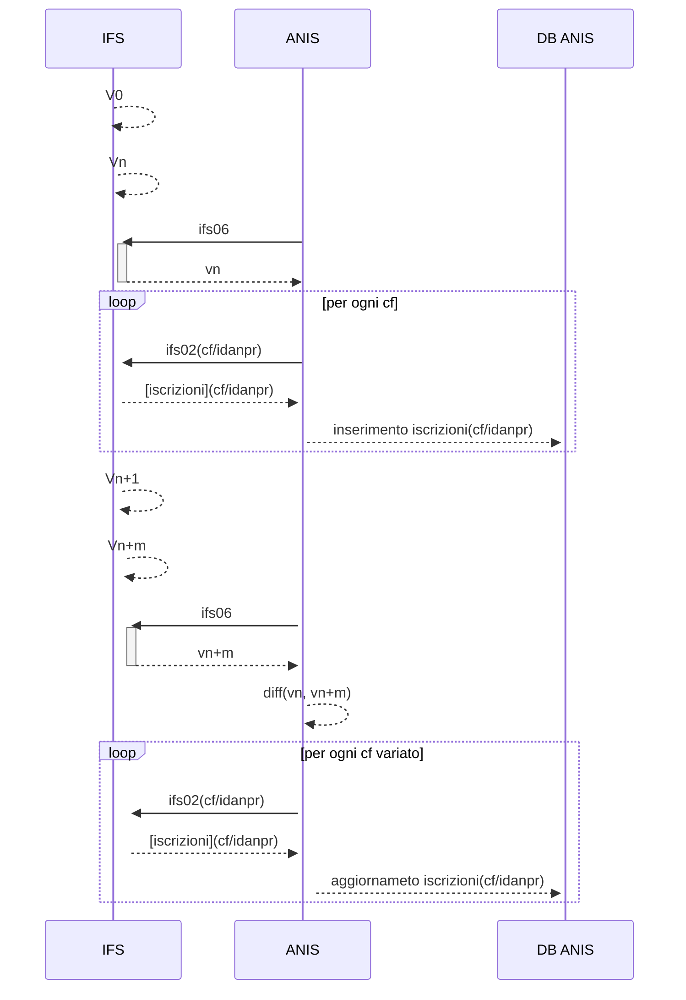

```mermaid
sequenceDiagram
    IFS-->>+IFS:V0
    IFS-->>+IFS:Vn
    ANIS->>+IFS: ifs06
    IFS-->>-ANIS:  vn
    loop per ogni cf 
        ANIS->>IFS: ifs02(cf/idanpr)
        IFS-->>+ANIS: [iscrizioni](cf/idanpr)
        ANIS-->>+DB ANIS: inserimento iscrizioni(cf/idanpr)
    end
    IFS-->>+IFS:Vn+1
    IFS-->>+IFS:Vn+m
    ANIS->>+IFS: ifs06
    IFS-->>-ANIS: vn+m
    ANIS-->>+ANIS: diff(vn, vn+m)
    loop per ogni cf variato
        ANIS->>IFS: ifs02(cf/idanpr)
        IFS-->>+ANIS: [iscrizioni](cf/idanpr)
        ANIS-->>+DB ANIS: aggiornameto iscrizioni(cf/idanpr)
    end
```
