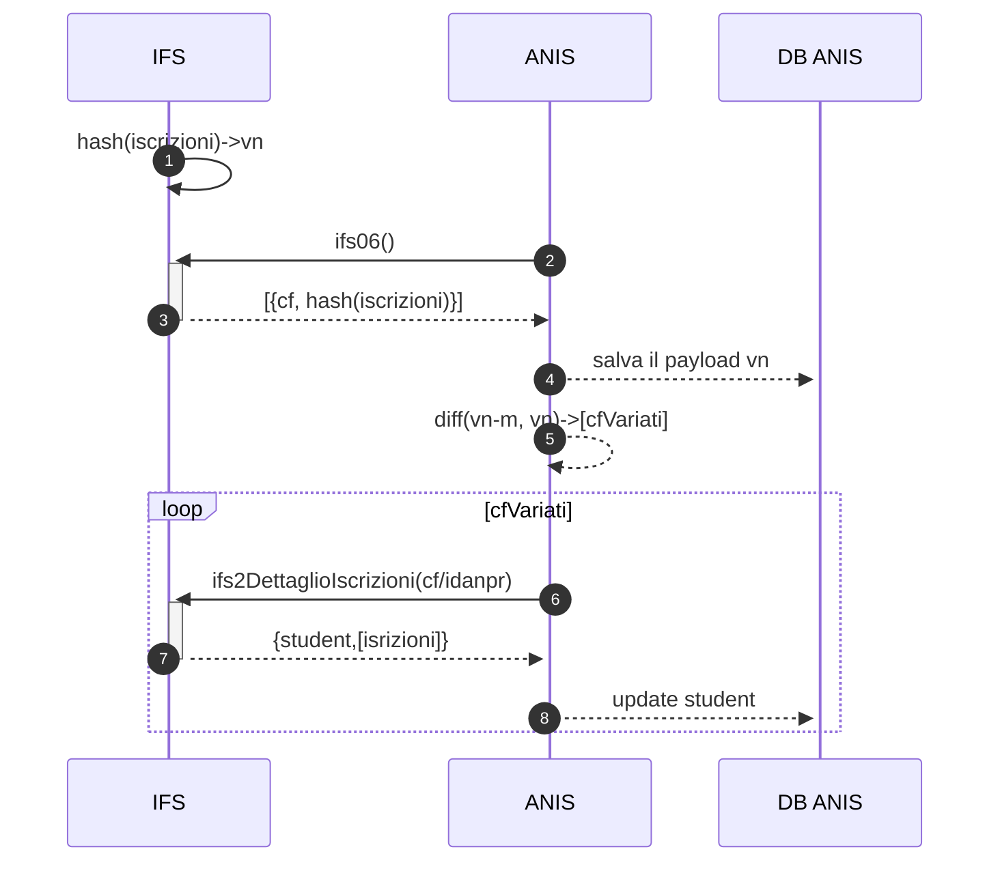

```mermaid
sequenceDiagram
    autonumber
    IFS->>+IFS: hash(iscrizioni)->vn
    ANIS->>+IFS: ifs06()
    IFS-->>-ANIS: [{cf, hash(iscrizioni)}]
    ANIS-->>+DB ANIS: salva il payload vn
    ANIS-->>+ANIS: diff(vn-m, vn)->[cfVariati]
    loop cfVariati
        ANIS->>+IFS: ifs2DettaglioIscrizioni(cf/idanpr)
        IFS-->>-ANIS: {student,[isrizioni]}
        ANIS-->>+DB ANIS: update student
    end
```
