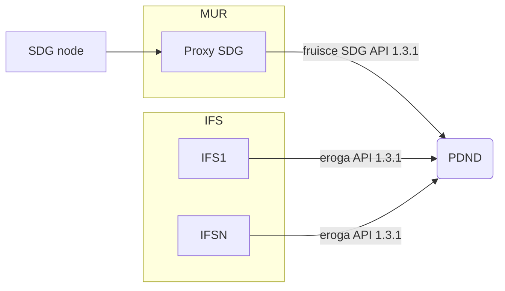

```mermaid
flowchart LR
    SDG[SDG node] 
    PDND(PDND)
    SDG --> PROXY
    subgraph MUR
        PROXY[Proxy SDG]
    end
    subgraph IFS
        IFS1[IFS1] 
        IFSN[IFSN] 
    end
    PROXY --> |fruisce SDG API 1.3.1|PDND
    IFS1 --> |eroga API 1.3.1|PDND
    IFSN --> |eroga API 1.3.1|PDND
```
